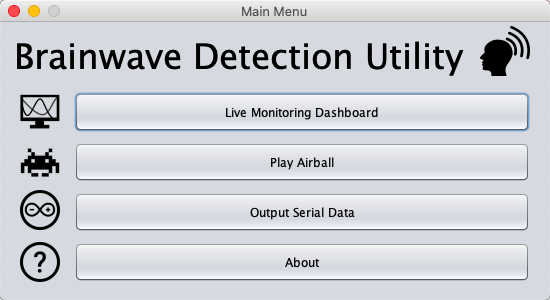
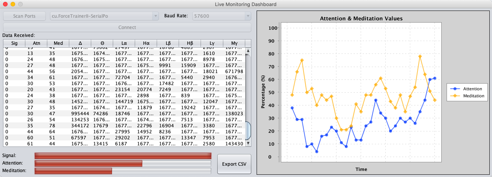
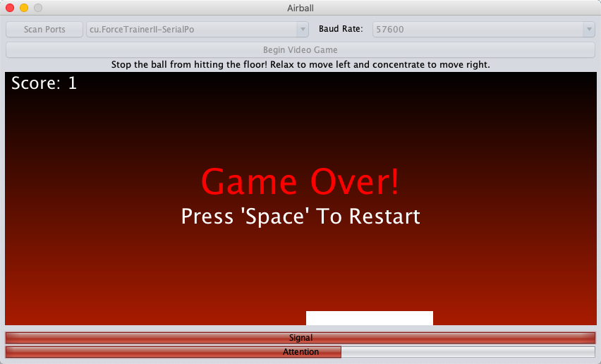
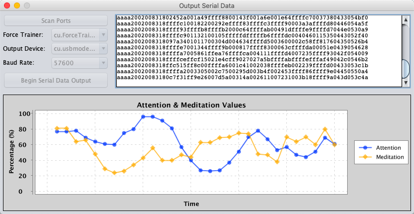

# Brainwave Detection Utility
A utility designed to interact with the "Star Wars The Force Trainer II" headset.

## About
Brainwave Detection Utility (BDU) is designed to work with the "Star Wars The Force Trainer II" headset. Other NeuroSky products should work but are untested.
- This program uses jSerialComm, a platform-independent serial port access for Java. You can learn more about it here: https://fazecast.github.io/jSerialComm/.
- This program also uses XChart, a light-weight and convenient library for plotting data. You can learn more about it here: https://knowm.org/open-source/xchart/.
- BDU is licensed to you under the Apache 2.0 License. See https://www.apache.org/licenses/LICENSE-2.0.txt for more information.

## Features
* Basic Data Visualisation
* CSV Export
* Basic Gameplay
* Serial Data Output

## Screenshots

